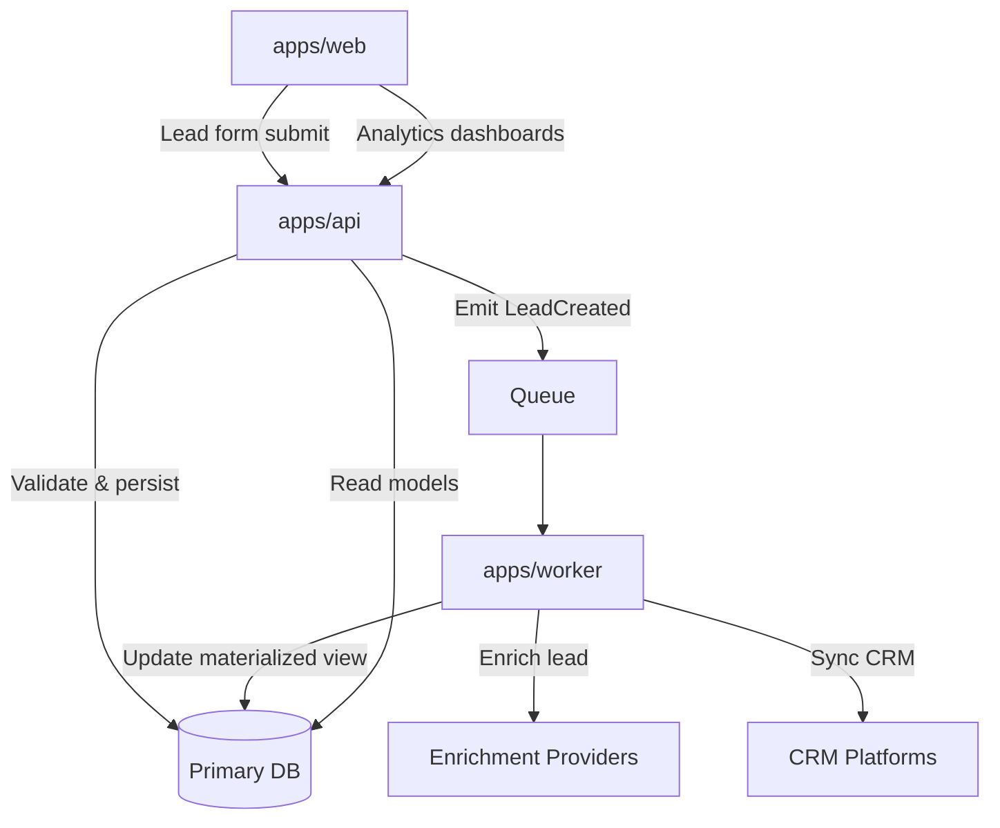

# Wilson Architecture Guide

This guide captures the current architecture of the Wilson Lead Generation system
and how Edison composes the project-specific overlays that support it. Keep this
document close to the codebase and update it whenever the architecture changes
so new contributors can reason about the system with confidence.

## Project Structure Overview

- `apps/web`: Public React/Next.js experience for marketers and sales teams.
- `apps/api`: Fastify-based API gateway that exposes REST and event endpoints.
- `apps/worker`: Background job runner for enrichment, scoring, and syncing.
- `packages/domain`: Domain entities, value objects, and application services
  shared across API and worker processes.
- `packages/ui`: Reusable design-system components consumed by `apps/web`.
- `packages/integrations`: Adapters for CRM, email providers, and enrichment
  vendors (HubSpot, Salesforce, Clearbit, Apollo).
- `packages/infra`: Terraform + Pulumi definitions for network, queues, and
  observability. Managed via pipelines, not by application code.
- `.edison/`: Project overlays (guidelines, packs, config) layered on top of
  Edison core; regenerated artifacts live in `.edison/_generated/`.

Guiding principles:

1. Separation of concerns between presentation (`apps/web`), orchestration
   (`apps/api`), and asynchronous processing (`apps/worker`).
2. Shared domain and integration packages to avoid duplication across runtimes.
3. Everything composable through Edison layers (core → packs → project overlays).

## Key Architectural Decisions

- **API Gateway + Worker Split**: HTTP traffic terminates at `apps/api`; heavy
  enrichment and sync tasks are pushed to `apps/worker` via the queue layer to
  keep P99 latency low.
- **Domain-Driven Modules**: Lead, Account, Campaign, and Activity live in
  `packages/domain`; services expose use-case methods (e.g., `score_lead`,
  `sync_crm_record`) that isolate business rules from transport details.
- **Integration Adapters**: Each external system is wrapped in a port/adapter
  pair inside `packages/integrations`, enabling offline contract tests and
  runtime configuration of credentials via environment + YAML overlays.
- **Event-First Data Flow**: API writes emit domain events (LeadCreated,
  LeadScored, SyncRequested) to the queue; workers subscribe and project
  materialized views where needed.
- **Configuration as Data**: All pack activation, validator roles, and guide
  composition are driven by YAML under `.edison/config/`; no hardcoded project
  constants remain in code paths.
- **Fail-Fast Guardrails**: Edison composition deduplicates paragraphs across
  layers and enforces required sections so guidelines cannot silently truncate.

## Component Relationships

- `apps/web` → `apps/api`: Web UI calls authenticated API endpoints for lead
  ingestion, scoring status, and analytics queries.
- `apps/api` → `packages/domain`: API handlers delegate to application services
  for validation, command handling, and event emission.
- `apps/api` → Queue: Commands that require external I/O (enrichment, CRM sync)
  are published as events; only idempotent metadata is stored synchronously.
- `apps/worker` → `packages/integrations`: Workers translate domain events into
  provider-specific API calls; retries and backoff handled in the worker layer.
- `packages/domain` ↔ `packages/integrations`: Domain services depend on
  integration ports; adapters implement those ports to keep business logic pure.
- Observability: All services emit structured logs and traces with correlation
  IDs propagated from the API gateway; metrics aggregated via the infra package.

## Data Flow

### Data Flow Notes

- Writes are append-only with idempotency keys so retries are safe.
- Read models are optimized for dashboard latency; source-of-truth lives in the
  primary relational store.
- Integration credentials and endpoints are provided via YAML config and env
  vars; no secrets are embedded in code or documentation.

## Conclusion

The Wilson architecture favors composable domain modules, event-driven flows,
and configuration-driven behavior layered through Edison. Keep the queue
decoupling intact, extend integrations through adapters, and update this guide
whenever structure or data contracts change. This document will be kept current as the Wilson architecture evolves.
